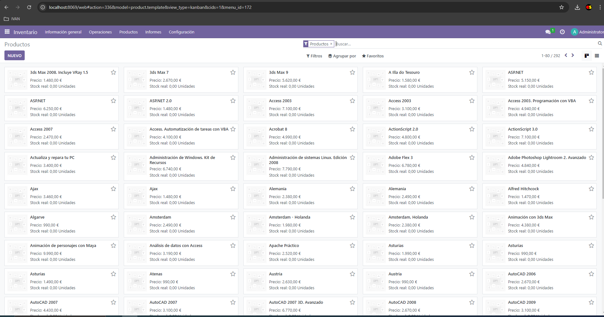

# Practica 2
## Habilitar el módulo Inventario

Para ello vamos al apartado Aplicaciones y buscamos "Inventario"

Una vez habilitado, añadiremos/importaremos los productos de un fichero Excel. Para ello vamos al apartado Inventario, y en la cinta de opciones superior pulsamos en "Productos", seguidamente en "Favoritos" y hacemos click en importar registros. Rellenamos los campos con la informacion que nos pide Odoo y pulsamos en importar.

## Habilitar la busqueda de Google Images

Comenzamos visitando la página de Google APIs, nos registramos, creamos nuestro proyecto 